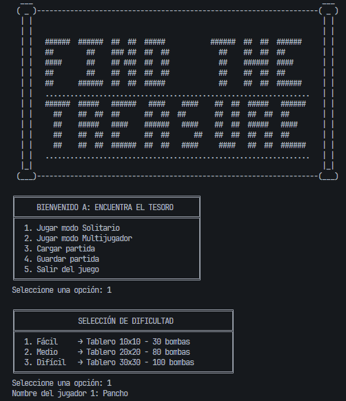
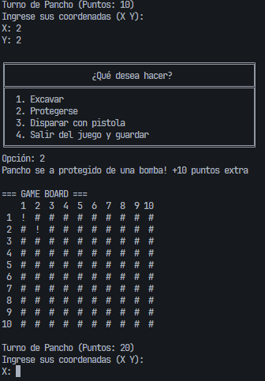

[](https://classroom.github.com/a/mi1WNrHU)

# Proyecto de C++ - Encuentra el Tesoro 💣💰

## Descripción del Proyecto

Este proyecto consiste en un juego de consola en C++ llamado **"Encuentra el Tesoro"**. El objetivo es que uno o varios jugadores exploren un tablero oculto en busca de tesoros, evitando caer en bombas. El juego incluye:

- Modo **multijugador** (hasta 4 jugadores).
- Tres niveles de **dificultad** (fácil, medio, difícil).
- Funcionalidad de **guardar y cargar partidas**.
- Sistema de puntaje y retiro voluntario.
- Visualización del tablero en consola usando ASCII.

Los jugadores introducen coordenadas para explorar el mapa. Si encuentran un tesoro, ganan puntos. Si pisan una bomba, pierden. Si alcanzan cierto puntaje, pueden decidir retirarse.

## 🎮 Características Principales

- 📜 Interfaz tipo ASCII con Sprites animados
- 🧭 Tablero de exploración con casillas ocultas
- 💣 Bombas ocultas con explosiones gráficas
- 💰 Tesoros que otorgan puntos
- 🛡️ Escudos para evitar morir por bombas
- 🔫 Pistolas para desactivar bombas y ganar puntos
- 🧑‍🤝‍🧑 Soporte para hasta **4 jugadores**
- 💾 Sistema de **guardado/carga** de partidas (hasta 3 slots)
- 📊 Tabla de posiciones al final
- 🎯 Victoria alcanzando 60 puntos o siendo el mejor jugador vivo

---

## 🛠️ Estructuras Principales

### `Difficulty`

Maneja configuración del juego:

- Tamaño del tablero (`maxRows`, `maxColumns`)
- Número de bombas (`maxBombs`)
- Balas y escudos por jugador

### `GameData`

- Número de jugadores
- Estado del juego (`game_status`)
- Coordenadas de bombas explotadas, repeticiones y tesoros

### `Players[4]`

Arreglo de hasta 4 estructuras `Players` con:

- Nombre
- Puntos, balas, escudos
- Estados como vivo, excavando, disparando, etc.

### `ErrorType`

Manejo de errores:

- Coordenadas repetidas
- Bombas activadas
- Coordenadas fuera de rango

---

## 🧩 Mecánicas de Juego

### 🎲 Turnos

Cada jugador realiza un turno y elige una acción:

1. **Excavar** → Puede encontrar tesoros (+20 pts), bombas (muere), o nada
2. **Protegerse** → Usa un escudo para evitar morir si pisa una bomba
3. **Disparar** → Usa una bala, gana +10 pts si hay bomba
4. **Guardar/Cargar partida**

### 💣 Bombas

- Ocultas en coordenadas aleatorias
- Activan sprite de explosión
- Matan al jugador (a menos que use escudo o dispare)

### 💰 Tesoros

- Otorgan **20 puntos**
- El jugador puede **retirarse** al llegar a 60 puntos

### 🧾 Tablero

- `#`: No explorado
- `.`: Ya explorado sin tesoro ni bomba
- `!`: Bomba
- `$`: Tesoro

---

## 🧱 Mockup de Interfaz en Consola





## 📂 Sistema de Guardado/Carga

- Archivos guardados en la carpeta: `partidas_guardadas/`
- Hasta **3 partidas** disponibles
- Se guarda:
  - Dificultad y configuración del tablero
  - Estado completo de los jugadores
  - Coordenadas de bombas, repeticiones, explosiones, tesoros

---

## 🧵 Flujo del Juego

```
[Inicio del juego]
     ↓
[Menú principal]
     ↓
[Solitario / Multijugador]
     ↓
[Configurar dificultad y jugadores]
     ↓
[Turnos por jugador → excavar, protegerse, disparar]
     ↓
[Eventos: bomba, tesoro, nada]
     ↓
[Guardar / Cargar disponible en cada turno]
     ↓
[Victoria si: 60 puntos]
```

---

## 📦 Archivos y Funciones Clave

| Archivo / Función        | Descripción                                                                 |
| ------------------------ | --------------------------------------------------------------------------- |
| `main()`                 | Inicia el juego, muestra el título y lanza el menú principal                |
| `game_menu()`            | Muestra el menú de juego (Solitario, Multijugador, Salir)                   |
| `game_multiplayer()`     | Controla el flujo del turno por jugador                                     |
| `player_configuration()` | Configura nombre y recursos iniciales de los jugadores                      |
| `prove_coordinates()`    | Verifica si se pisa bomba, tesoro, fuera de rango, etc.                     |
| `save_game()`            | Guarda partida en un archivo dentro de `/partidas_guardadas/`               |
| `load_game()`            | Carga una partida guardada                                                  |
| `print_board()`          | Muestra el estado del tablero actual                                        |
| `victory()`              | Muestra la pantalla de victoria y tabla de puntos                           |
| `reset_game_state()`     | Reinicia el juego y limpia estructuras de estado                            |
| `sprite(type)`           | Imprime sprites ASCII del tipo solicitado (`Title`, `Bomb`, `Winner`, etc.) |

---

## ✅ Requisitos

- Sistema con compilador C++11 o superior
- En Windows, se recomienda usar `g++` de MinGW o compilador de Visual Studio

---

## 🧪 Ejemplo de Compilación (en terminal)

```bash
g++ main.cpp -o tesoro.exe
./tesoro.exe
```

## Estructuras de Control Utilizadas

- Condicionales: `if`, `else if`, `switch`
- Ciclos: `for`, `while`
- Estructuras (`struct`) para modelar:
  - Jugadores
  - Estado del juego
  - Configuración de dificultad
- Funciones modulares para organizar el código

## Equipo

- **Nombre del equipo:** IOT(Inexpertos Obligados a Trabajar)

### Integrantes del equipo

1. **Nombre completo:** Oscar Ignacio Gil Villalta  
   **Carnet:** 00186825

2. **Nombre completo:** Emely Rubí Fuentes Sandoval  
   **Carnet:** 00126020

3. **Nombre completo:** Rodrigo Alejandro Campos Cierra  
   **Carnet:** 00167625

## Instrucciones de Ejecución

1. Clona este repositorio en tu máquina local:
   ```bash
   git clone https://github.com/usuario/repositorio.git
   cd repositorio
   ```